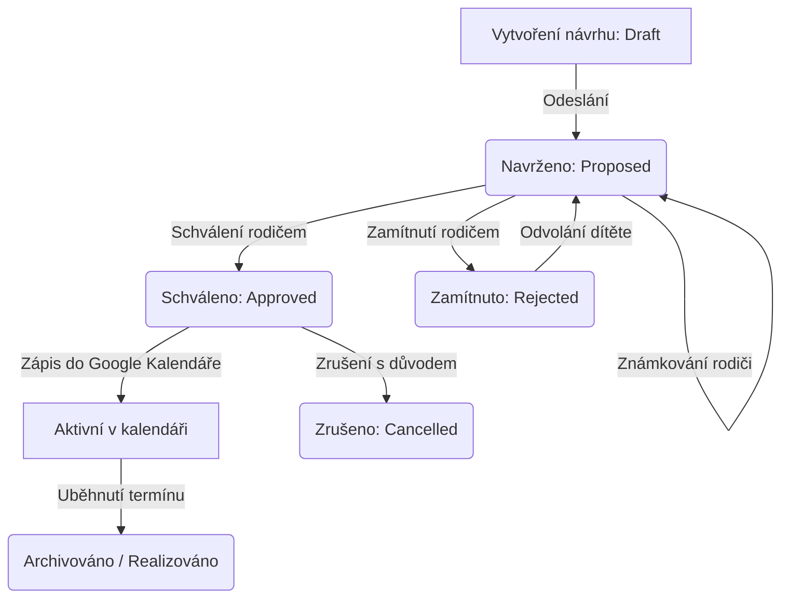

# 📖 Uživatelský manuál aplikace Víkendovník

Tento manuál popisuje základní funkce a workflow aplikace **Víkendovník** – rodinného plánovače víkendových aktivit, který integruje prvky gamifikace, umělé inteligence a propojení s Google Kalendářem.

---

## 🔑 1. Přihlášení a Správa Uživatelů

### Přihlášení přes Google
* Aplikace využívá **Google OAuth 2.0** pro bezpečné a rychlé přihlášení.
* Po přihlášení se e-mail uživatele uloží do Firestore v kolekci `users`.
* **Dynamické mapování**: Jména a avatary členů rodiny se nenačítají z napevno napsaného seznamu v kódu, ale jsou plně dynamicky odvozeny z uživatelských profilů spravovaných v **Admin Hubu** (podle nastaveného jména `displayName` nebo `adminAlias`):
  * Pokud se přihlásí uživatel s e-mailem/aliasem `zefran3`, aplikace ho automaticky namapuje na jméno **Táta** (jakožto hlavního správce a administrátora).
  * Ostatní členové rodiny mají své účty spravované a pojmenované administrátorem v rozhraní pro správu uživatelů, odkud se načítají i jejich avatary.

### Uživatelské Role a Oprávnění
Administrátor může v **Admin Hubu** spravovat role a parametry uživatelů:
* **Admin (Administrátor)**: Má kompletní práva, spravuje uživatele, spouští AI Agenta, schvaluje i vytváří aktivity.
* **Rodič (Parent)**: Může navrhovat, komentovat, známkovat a schvalovat aktivity a přání dětí.
* **Dítě (Child)**: Může navrhovat aktivity, odvolávat se proti zamítnutí, plnit mise, spravovat svůj Seznam přání a odemykat odměny v Battle Passu.
* **Divák (Viewer)**: Může si prohlížet nástěnku a navrhovat aktivity, ale nemůže komentovat ani schvalovat.

Pro uživatele s rolí **Dítě** může admin dodatečně nastavit:
* **Target Group** (Cílová skupina): Určuje, které AI tipy dítě uvidí (Vše / Jen pro dceru / Jen pro syna).
* **Rok narození**: Slouží k automatickému a dynamickému výpočtu věku dítěte pro AI doporučení.

---

## 📅 2. Workflow Návrhů Aktivit

Hlavním účelem aplikace je plánování víkendového programu. Celý proces prochází definovaným životním cyklem (workflow):

### 1. Vytvoření návrhu
Uživatel klikne na tlačítko pro přidání nového návrhu. Může zvolit dva typy:
* **Aktivita (Activity)**: Standardní výlet, kino, sportovní událost. Zadává se název, popis, předpokládaný den (sobota/neděle), čas, lokace a odkaz na web. Návrh lze uložit jako *Draft* (koncept) nebo rovnou odeslat ke schválení (*Proposed*).
* **Spolujízda (Ride)**: Logistický návrh na přepravu (odkud, kam, čas a detaily jízdy).

### 2. Známkování (Grading)
* Rodiče mohou odeslané návrhy známkovat jako ve škole (**známky 1 až 5**).
* Z těchto známek se počítá průměrné hodnocení aktivity.
* Jako ochrana proti spekulacím a neustálým změnám může každý rodič u jednoho návrhu upravit svou známku **maximálně 3krát**.

### 3. Schvalování a kontrola kolizí
Při schválení aktivity rodičem se zobrazí schvalovací formulář:
* Určí se přesný **datum a čas** konání.
* Rodič může označit, zda aktivita vyžaduje přípravu detailů (`Claim Details`) nebo zda je zcela zdarma/se slevou (`Claim Free`).
* **Kontrola kolizí**: Systém na pozadí zkontroluje Google Kalendář. Pokud v daný čas již existuje jiná událost, zobrazí se varování:
  * *Přímá kolize* (čas se překrývá).
  * *Nárazníková zóna (Buffer)* (události jsou těsně po sobě).
  * *Celodenní kolize* (v ten den je naplánovaná celodenní událost, např. víkend bez dětí).
  Rodič se může rozhodnout kolizi ignorovat, změnit čas, nebo návrh rovnou zamítnout.
* Po schválení se aktivita **automaticky zapíše do rodinného Google Kalendáře**.

### 4. Zamítnutí a Odvolání (Appeal)
* Pokud rodič návrh zamítne, musí uvést **důvod zamítnutí**.
* Dítě, které aktivitu navrhlo, má právo se proti rozhodnutí **jednou odvolat** (napsat argumenty, proč je akce super).
* Návrh se pak vrátí zpět do stavu k posouzení. Pokud ho rodič zamítne i podruhé, je rozhodnutí konečné.

### 5. Zrušení (Cancel) a Archivace
* Již schválenou aktivitu lze dodatečně zrušit (např. z důvodu nepříznivého počasí). Rodič nebo autor musí uvést důvod zrušení.
* Dokončené (odjeté) a zrušené události se automaticky přesouvají do **Archivu**, kde je lze zpětně dohledat. Administrátor může archivované položky hromadně promazávat.

---

## 🤖 3. AI Agent a Víkendové Inspirace

Aplikace pomáhá s vymýšlením programu pomocí automatizovaného scrapingu a umělé inteligence:

### Zdroje dat (Scraping)
Na serveru běží scrapery, které pravidelně stahují aktuální události z:
* **Kudy z nudy**: Populární turistické a volnočasové tipy.
* **Jižní Morava**: Regionální akce a události.
* **CineStar Olomouc / MKS Vyškov**: Programy kin včetně konkrétních časů promítání a přímých odkazů na nákup vstupenek.

### Generování tipů přes Gemini
* AI Agent (využívající Gemini API) zpracuje surová data ze scraperů a vygeneruje **Víkendové tipy (Inspirace)** na míru rodině.
* Tyto tipy zohledňují věk dětí a nastavené filtry (např. možnost zobrazit pouze akce z Vyškova a okolí).
* Rodič může jakýkoliv AI tip jedním kliknutím **převést na rodinný návrh** (Draft), upravit detaily a sdílet ho s rodinou.

### Generátor cyklotras
* Samostatný modul umožňující vygenerovat cyklistický výlet na míru.
* Uživatel zadá **délku trasy** (5–80 km) a **obtížnost** (Lehká/Rodinná, Střední/Hobby, Těžká/Sportovní).
* Tlačítko **"Překvap mě"** vybere náhodný směr trasy.
* Vygenerovanou trasu si lze stáhnout ve formátu **GPX** pro navigaci nebo ji uložit jako rodinný návrh.

---

## 🎮 4. GameHub – Motivační a Herní Systém

Pro zvýšení zapojení dětí obsahuje aplikace propracovaný gamifikační systém:

### Zlaté Bludišťáky (ZB Body) a Tituly
Děti získávají body za aktivitu:
* **5 ZB**: Zapsání jakéhokoliv nápadu na aktivitu.
* **20 ZB**: Schválení a úspěšná realizace navržené akce.
* **5 ZB**: Dodání detailů (lokace + webový odkaz) k realizované akci.
* **10 ZB**: Pokud je realizovaná akce zcela zdarma.
* Body z tajných misí a bonusové body za získané odznaky.

Na základě celkových získaných bodů děti automaticky získávají prestižní **Tituly**:
* 0+ ZB: **Zelenáč** 👤
* 50+ ZB: **Cestovatel** emerald
* 150+ ZB: **Průzkumník** cyan
* 300+ ZB: **Taktický plánovač** violet
* 500+ ZB: **Velitel výprav** amber
* 800+ ZB: **Legendární stratég** rose

### Odznaky (Badges)
Za specifické milníky děti získávají jednorázové odznaky spojené s bodovým bonusem:
* **První jiskra** (zapsání 1. nápadu) -> +5 ZB
* **Generátor nápadů** (5 zadaných nápadů) -> +10 ZB
* **Detailista** (dodány detaily u 3 aktivit) -> +10 ZB
* **Série 3** (3 schválené aktivity v řadě) -> +10 ZB
* **Kulturní maniak** (3 realizované kultury) -> +15 ZB
* **Horský kamzík** (2 outdoorové aktivity) -> +15 ZB
* **Lovec slev** (3 akce zcela zdarma) -> +15 ZB
* **Dekáda výletů** (10 realizovaných aktivit) -> +20 ZB

### Sezóny a cykly (Sprint vs. Maraton)
* **Sprint (60 dní)**: Aktivní sezónní cyklus. Během 60 dní děti sbírají body do sezónního žebříčku a odemykají si odměny v **Battle Passu**. Po 60 dnech se sprintové body resetují a začíná nový Battle Pass.
* **Maraton (Liga)**: Dlouhodobý celkový žebříček. Body v maratonu se nikdy neresetují a slouží k získávání celoživotních titulů.
* Rodič může ligu v Admin sekci pozastavit (např. během prázdnin) nebo zcela resetovat.

### Battle Pass a odměny
Děti si za body nasbírané v aktuálním Sprintu odemykají skvělé odměny:
1. **20 ZB**: 🍿 Popcorn k rodinnému promítání.
2. **40 ZB**: 🥤 Kofola / Sladkost podle výběru.
3. **60 ZB**: 🌙 Jednorázová prodloužená večerka o víkendu.
4. **90 ZB**: 🍽️ Nedělní menu / Fast Food (výběr jídla).
5. **120 ZB**: 🎬 Společná návštěva kina / Lístek na film.
6. **150 ZB**: 🎮 Herní čas na PC/konzoli.

Rodič může odměny a jejich bodové požadavky libovolně upravovat.

### Tajné mise (Mystery Quests)
* Rodič může vytvořit časově omezenou výzvu (např. *„Ujdi o víkendu 10 000 kroků“* nebo *„Pomoz s přípravou oběda“*).
* Nastavuje časový limit (v hodinách) a násobič odměny (např. 2x XP).
* Dítě po splnění klikne na **„Mám hotovo“** a rodič splnění schválí, čímž dojde k vyplacení bodů.
* **Underdog bonus (Dorovnávací bonus)**: Pokud bodově pozadu jdoucí dítě plní misi, automaticky získá dodatečný bonus (+5, +10 nebo +15 ZB podle velikosti bodové ztráty na vedoucího hráče), což pomáhá udržet motivaci všech dětí.

### Seznam přání (Wishlist)
* Děti si mohou do svého seznamu přání ukládat věci, které by si přály (např. lego, hračka, knížka) včetně odkazu.
* Rodič přání zkontroluje a buď schválí, nebo zamítne s vysvětlením.
* Pokud ho schválí, **přiřadí mu cenu v ZB bodech** (např. 500 ZB).
* Jakmile dítě nasbírá dostatek bodů, může si přání "zakoupit" a rodič mu ho pořídí výměnou za nasbírané body.

---

## 🛠️ 5. Administrátorské Akce a Systémové Logy

V **Admin Hubu** mají uživatelé s rolí `admin` přístup k systémovým nástrojům:
* **Spuštění AI Agenta**: Tlačítko pro okamžité spuštění scraperů a regeneraci víkendových tipů.
* **System Logs**: Zobrazení detailních logů o běhu aplikace (úspěšná volání, chyby API, limity Gemini API, starty scraperů). Užitečné pro diagnostiku případných problémů s načítáním dat.
